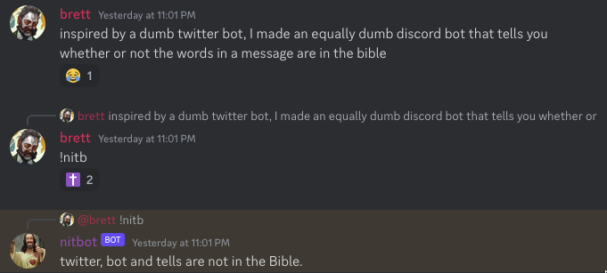

# nitbot
```
N - Not
I - In
T - The
B - Bible
O
T
```

A simple Discord bot that can tell you which words in a message aren't found in the Bible.

## Requirements
```
python = "^3.9"
discord-py = "^2.2.2"
python-decouple = "^3.8"
nltk = "^3.8.1"
contractions = "^0.1.73"
```

## Installation
Clone the repository to your destination of choice:
```
git clone https://github.com/bheinks/nitbot.git
```

Install required libraries:
```
pip install -r requirements.txt
```

This script uses [NLTK](https://www.nltk.org/) and requires the Punkt sentence tokenizer. Run the following in a Python shell:
```
import nltk
nltk.download('punkt')
```

Use of this bot also requires a Discord bot account. Instructions can be found [here](https://discordpy.readthedocs.io/en/stable/discord.html). Once created, copy your token and keep it handy (will either be passed in via command line or set as an environment variable).

## Usage
```
usage: nitbot.py [-h] [-s SOURCE] [-t TOKEN]

A simple Discord bot to tell you if your users' deranged ramblings are holy or not

options:
  -h, --help            show this help message and exit
  -s SOURCE, --source SOURCE
                        newline-delimited bible source file (defaults to KJV in English)
  -t TOKEN, --token TOKEN
                        Discord token (overrides DISCORD_TOKEN environment variable)
```

Example of a systemd service:
```
[Unit]
Description=nitbot Discord bot service
After=multi-user.target

[Service]
Type=simple
Restart=always
WorkingDirectory=/path/to/nitbot
ExecStart=/path/to/nitbot/nitbot.py
Environment=DISCORD_TOKEN=...

[Install]
WantedBy=multi-user.target
```

Once running, simply invite the bot to your server and reply to a message with `!nitb` to analyze the replied-to message, or supply the text to be analyzed following `!nitb` if not in reply.

## Examples

Used in reply:


Used directly:
